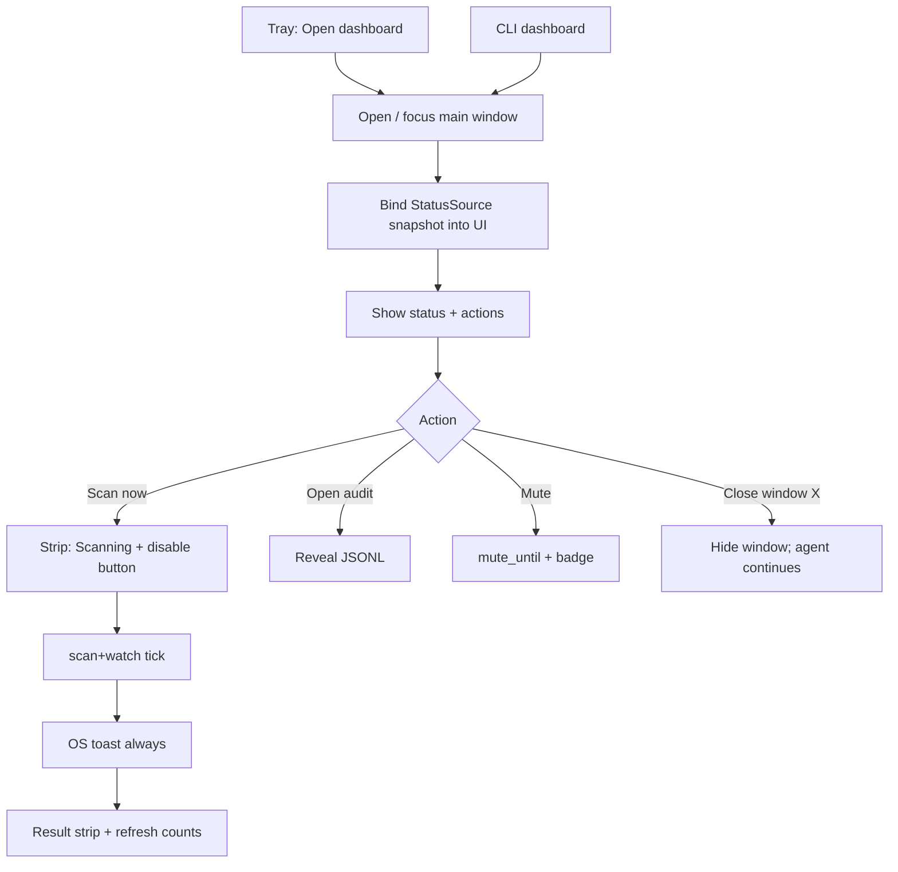

# REQ-MAIN-UI — flows

```mermaid
flowchart TD
  tray[Tray: Open dashboard] --> win[Open / focus main window]
  cli[CLI dashboard] --> win
  win --> bind[Bind StatusSource snapshot into UI]
  bind --> ready[Show status + actions]
  ready --> act{Action}
  act -->|Scan now| scanBusy[Strip: Scanning + disable button]
  scanBusy --> tick[scan+watch tick]
  tick --> toast[OS toast always]
  toast --> result[Result strip + refresh counts]
  act -->|Open audit| reveal[Reveal JSONL]
  act -->|Mute| mute[mute_until + badge]
  act -->|Close window X| hide[Hide window; agent continues]
```
