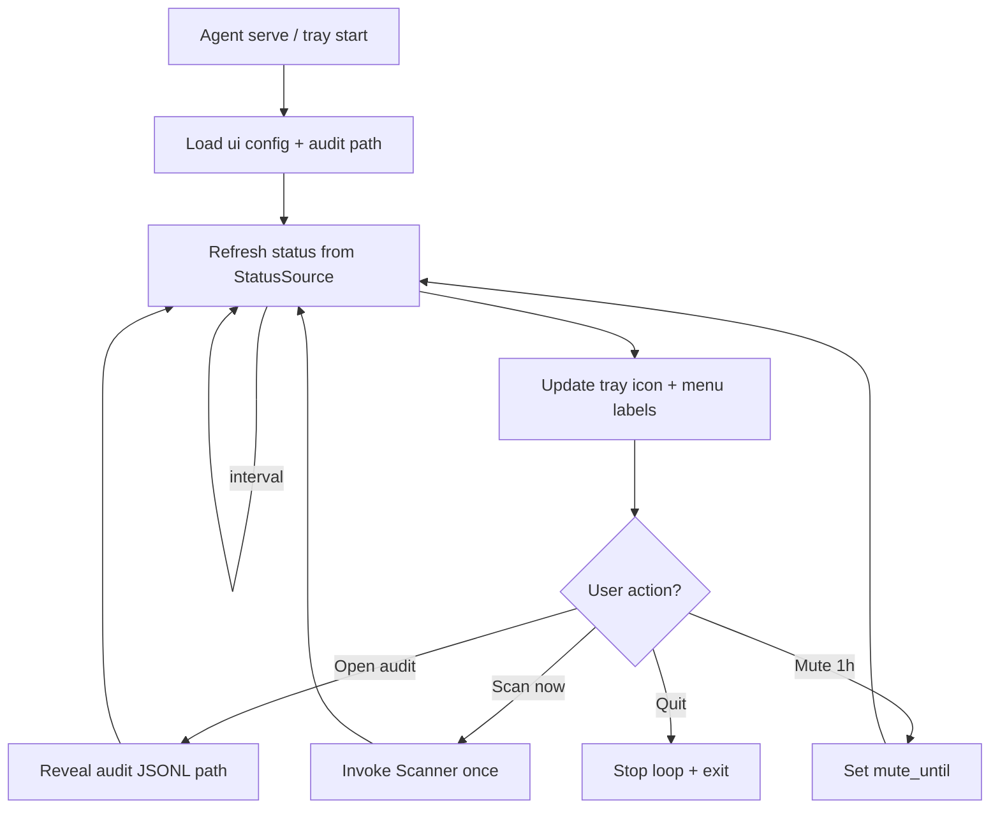
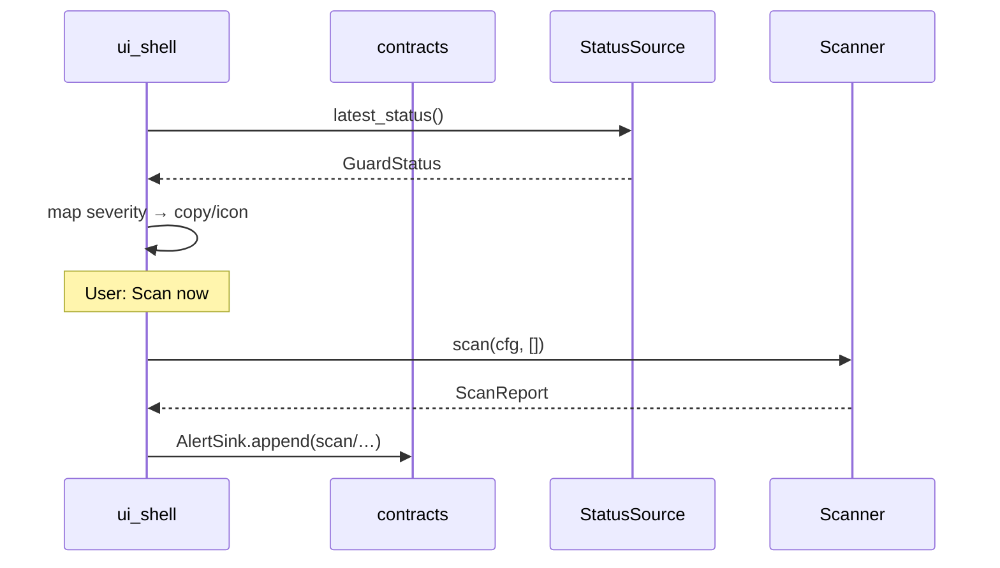

# REQ-TRAY-UI — flows

```mermaid
flowchart TD
  boot[Agent serve / tray start] --> load[Load ui config + audit path]
  load --> poll[Refresh status from StatusSource]
  poll --> render[Update tray icon + menu labels]
  render --> wait{User action?}
  wait -->|Open audit| open[Reveal audit JSONL path]
  wait -->|Scan now| scan[Invoke Scanner once]
  wait -->|Mute 1h| mute[Set mute_until]
  wait -->|Quit| quit[Stop loop + exit]
  open --> poll
  scan --> poll
  mute --> poll
  poll -->|interval| poll
```

```mermaid
sequenceDiagram
  participant Tray as ui_shell
  participant Ports as contracts
  participant Src as StatusSource
  participant Scan as Scanner
  Tray->>Src: latest_status()
  Src-->>Tray: GuardStatus
  Tray->>Tray: map severity → copy/icon
  Note over Tray: User: Scan now
  Tray->>Scan: scan(cfg, [])
  Scan-->>Tray: ScanReport
  Tray->>Ports: AlertSink.append(scan/…)
```
