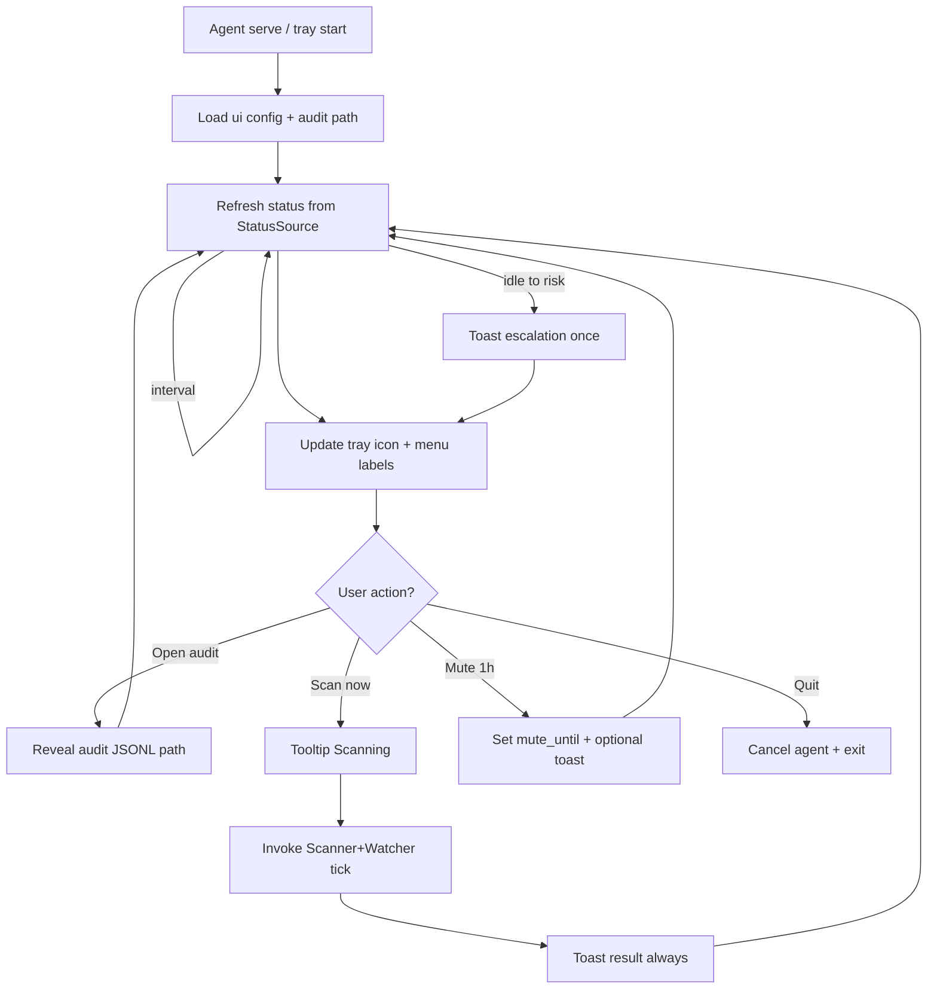
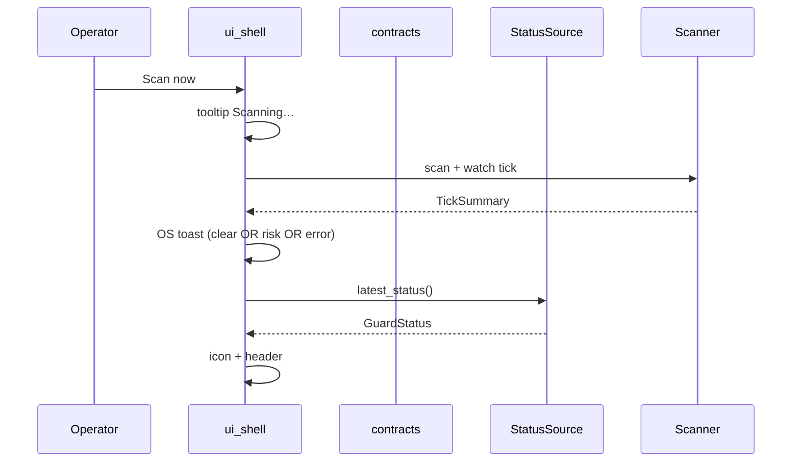

# REQ-TRAY-UI — flows

```mermaid
flowchart TD
  boot[Agent serve / tray start] --> load[Load ui config + audit path]
  load --> poll[Refresh status from StatusSource]
  poll --> render[Update tray icon + menu labels]
  render --> wait{User action?}
  wait -->|Open audit| open[Reveal audit JSONL path]
  wait -->|Scan now| scanning[Tooltip Scanning]
  scanning --> scan[Invoke Scanner+Watcher tick]
  scan --> toastScan[Toast result always]
  toastScan --> poll
  wait -->|Mute 1h| mute[Set mute_until + optional toast]
  wait -->|Quit| quit[Cancel agent + exit]
  open --> poll
  mute --> poll
  poll -->|interval| poll
  poll -->|idle to risk| toastEsc[Toast escalation once]
  toastEsc --> render
```

```mermaid
sequenceDiagram
  participant Op as Operator
  participant Tray as ui_shell
  participant Ports as contracts
  participant Src as StatusSource
  participant Scan as Scanner
  Op->>Tray: Scan now
  Tray->>Tray: tooltip Scanning…
  Tray->>Scan: scan + watch tick
  Scan-->>Tray: TickSummary
  Tray->>Tray: OS toast (clear OR risk OR error)
  Tray->>Src: latest_status()
  Src-->>Tray: GuardStatus
  Tray->>Tray: icon + header
```
