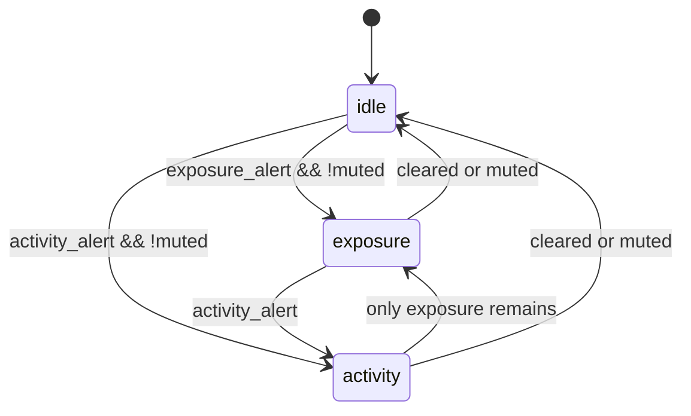

# REQ-TRAY-UI — states

| State id | Condition | Tray copy (default.toml) | Severity |
|----------|-----------|--------------------------|----------|
| `idle` | No unmuted exposure/activity in latest window | `tray.copy.idle` | ok |
| `scanning` | Operator clicked Scan now; tick in flight | tooltip only: `Scanning…` | (keep prior icon) |
| `exposure` | Unmuted exposure alert present; no higher activity | `tray.copy.exposure` | warn |
| `activity` | Unmuted activity alert present | `tray.copy.activity` | danger |

Transient `scanning` is **not** a durable StatusSource state — it is action feedback (see [`feedback.md`](./feedback.md)).

## Mute

- Action **Mute alerts (1h)** sets `mute_until = now + 1h`
- While `now < mute_until`, severity displays as `idle` for chrome, but audit continues
- Menu should still show muted status in a subtitle when muted (implementation detail)

## Transitions

