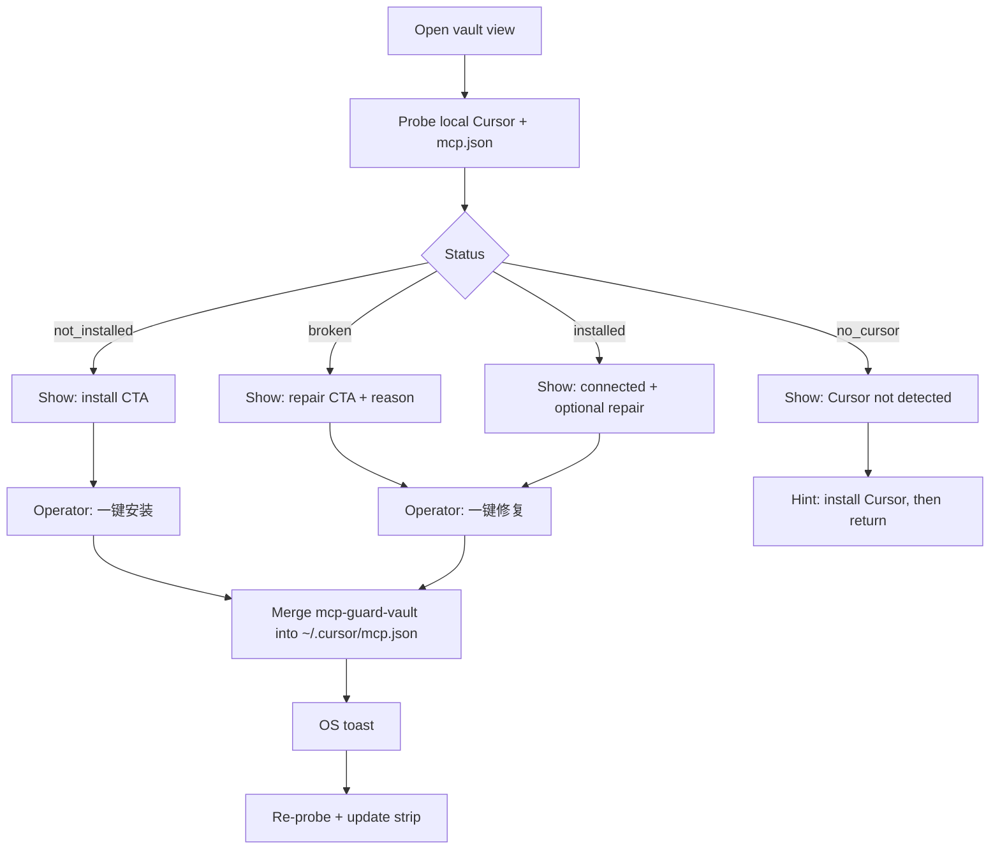

# REQ-VAULT-MCP-UI — flows

## Probe rules (logic)

1. **Cursor detected** if a known install signal exists (e.g. macOS `/Applications/Cursor.app`, or `~/.cursor` directory present). Prefer existence checks over process list.
2. **Installed** if `mcpServers["mcp-guard-vault"]` exists and `command` resolves to a runnable `mcp-guard` (or matches current exe) with `vault-mcp` in args.
3. **Broken** if key exists but command missing / not executable / args wrong.
4. Probe is **read-only**; install/repair is the only write path.
